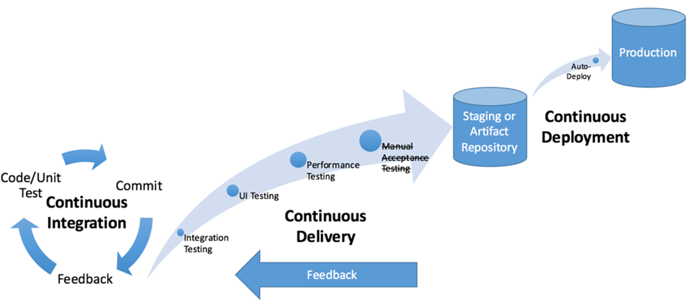
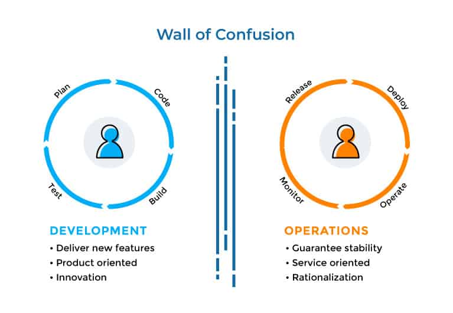
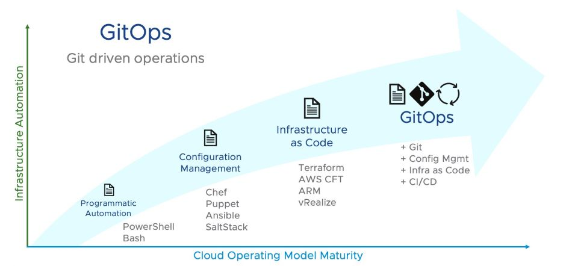
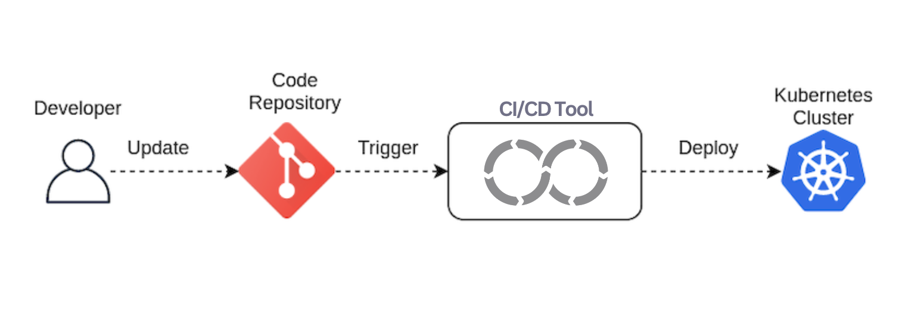
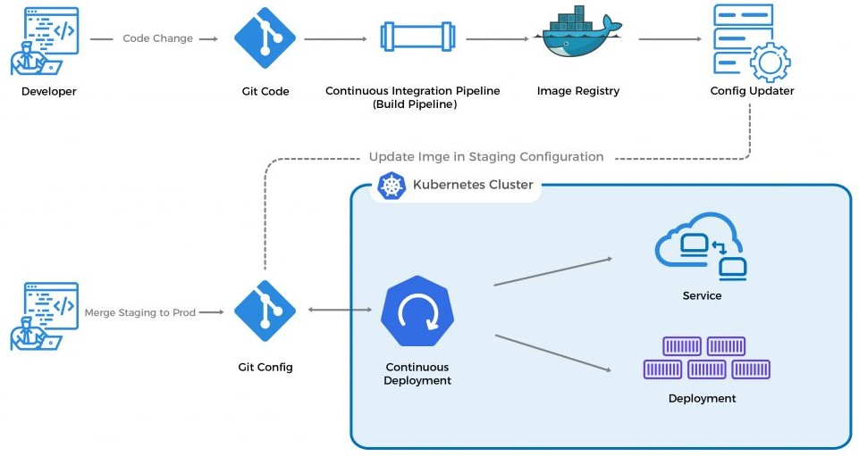
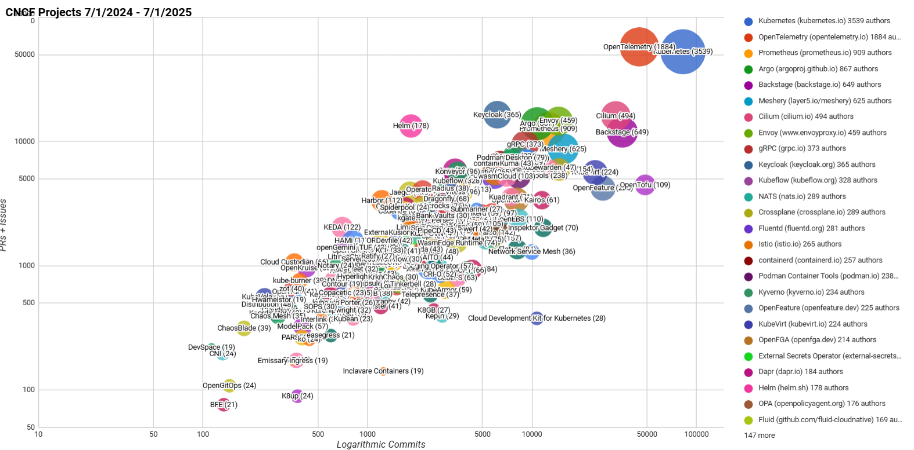

<!--
command: marp src/gitops-101.md --theme css/dracula.css
-->

# GitOps 101

Last updated in September 2025

---

## Intro - Lifecycle & CI/CD (Pega)

---

## Intro - DevOps wall of confusion ([Plutora](https://www.plutora.com/blog/what-is-enterprise-devops))

---

## Intro - Infrastructure automation dilemma

2020's need

* Dynamic environments
* Self-service portal
* 1 env = n components
* Single source of truth
* Easy to maintain by many
* Regular security patches
* 99.9x% availability

2010's approach

* CI/CD pipelines (push)
* Dev flow != Prod updates
* IaC complicated tooling
* No IaC orchestration standard
* Dev quality != Infra expertise

---

## GitOps - What? (GitLab)

> GitOps is an **operational framework** that takes DevOps best practices used for application development such as version control, collaboration, compliance, and CI/CD, and applies them to **infrastructure automation**.

🌐 [gitlab.com/gitops](https://about.gitlab.com/topics/gitops/)

---

## GitOps - What? (Atlassian)

> At its core, GitOps is **code-based infrastructure and operational procedures** that rely on Git as a source control system.\
> It’s an evolution of **Infrastructure as Code (IaC)** and a DevOps best practice that leverages **Git as the single source of truth**, and control mechanism for creating, updating, and deleting system architecture.

🌐 [atlassian.com/git/tutorials/gitops](https://www.atlassian.com/git/tutorials/gitops)

---

## GitOps - When? (Weaveworks)

---

## GitOps - When? ([VMware](https://blogs.vmware.com/cloud/2021/02/24/gitops-cloud-operating-model/))

---

## GitOps - Why?

Action             | Reason
-------------------|---------------------------------------
**SIMPLIFY**       | Small YAML declarative files
**OPEN**           | Much larger collaboration
**RESPONSIBILIZE** | The right profile for the right action
**SCALE**          | Same effort for 10 or 10 000 env
**SECURE**         | Processes fully automated & versioned
**MONITOR**        | Cloud Native Observability stack

---

## GitOps - Push Approach

🌐 [harness.io/blog](https://www.harness.io/blog/gitops-the-push-and-pull-approach)

---

## GitOps - Pull Approach

🌐 [harness.io/blog](https://www.harness.io/blog/gitops-the-push-and-pull-approach)

---

## OpenGitOps

> OpenGitOps is a set of open-source standards, best practices, and community-focused education to help organizations adopt a structured, standardized approach to implementing GitOps.

🌐 [opengitops.dev](https://opengitops.dev/) ([open-gitops/project](https://github.com/open-gitops/project))

---

## GitOps Principles

1. **Declarative**

2. **Versioned and Immutable**

3. **Pulled Automatically**

4. **Continuously Reconciled**

🌐 [opengitops.dev](https://opengitops.dev/#principles)

---

## GitOps & Kubernetes - What? ([ClickIT](https://www.clickittech.com/devops/what-is-gitops/))

---

## GitOps & Kubernetes - How? (1/4)

Kubernetes definition format:

* [Helm](https://helm.sh/)
* [Kustomize](https://kustomize.io/)
* Raw manifests

---

## GitOps & Kubernetes - How? (2/4)

Environment strategy:

* one per folder
* one per git branch
* one per git repository

---

## GitOps & Kubernetes - How? (3/4)

:warning: No secret values in git!

Secret management tool for Kubernetes:

* [Bitnami Sealed Secrets](https://github.com/bitnami-labs/sealed-secrets)
* [External Secrets Operator](https://external-secrets.io/)
* [Vault Secrets Operator](https://developer.hashicorp.com/vault/docs/platform/k8s/vso)
* [Kubernetes Secrets Store CSI Driver](https://secrets-store-csi-driver.sigs.k8s.io/)

---

## GitOps & Kubernetes - How? (4/4)

GitOps continuous delivery tool for Kubernetes:

* [Argo CD](https://argoproj.github.io/cd/)
* [Fleet](https://fleet.rancher.io/)
* [Flux](https://fluxcd.io/)

---

## Argo CD

> Argo CD is a declarative, GitOps continuous delivery tool for Kubernetes

🌐 [argoproj.github.io/cd](https://argoproj.github.io/cd/) ([argoproj/argo-cd](https://github.com/argoproj/argo-cd))

📝 [Akuity Enterprise for Argo](https://akuity.io/argo-enterprise)

---

## Fleet

> Fleet is a container management and deployment engine designed to offer users more control on the local cluster and constant monitoring through GitOps

🌐 [fleet.rancher.io](https://fleet.rancher.io/) ([rancher/fleet](https://github.com/rancher/fleet))

📝 [CustomResourceDefinition toolbox](https://doc.crds.dev/github.com/rancher/fleet), [Rancher integration](https://ranchermanager.docs.rancher.com/integrations-in-rancher/fleet/overview)

---

## Flux

> Flux is a set of continuous and progressive delivery solutions for Kubernetes that are open and extensible

🌐 [fluxcd.io](https://fluxcd.io/) ([fluxcd/flux2](https://github.com/fluxcd/flux2))

📝 [GitLab Integration](https://docs.gitlab.com/user/clusters/agent/gitops/)

---

## CNCF projects ([Project Velocity](https://github.com/cncf/velocity?tab=readme-ov-file#current-reports))

---

## GitOps - Getting started

* Enforce **good practices** in source code management with git
* Split integration/delivery/deployment tasks in pipelines
* Get **comfortable** with Helm charts
* **Evaluate** a set of tools and practices (ADRs)
* Start **small** in a non-production environment
* Add one component at a time
* Share regularly, get **feedbacks** and improve (Agile :D)
* Get people **on board** (DevOps \o/)

---

## GitOps - Advices for your journey

* **NEVER** store a secret value in git
  * Git never forgets (it it happens, generate a new one)
* Encourage Build & Run **COLLABORATION**
  * Dev & Ops can help each other (Dockerfile, Helm charts)
* Follow a **STANDARD**: Git Flow, GitHub Flow, GitLab Flow
  * Many issues come from a wrong usage of git branches
* Host and manage your **OWN** application catalog
  * Validate & share the applications that can be used

---

## Demonstration

* [Devpro](https://www.linkedin.com/in/berthomas/) (the author of this presentation ^^)
  * [GitOps samples](https://github.com/devpro/gitops-samples)
  * [Helm charts](https://github.com/devpro/helm-charts)

---

## References

* [What Is GitOps? A Beginner's Guide to GitOps Principles and Practices](https://akuity.io/blog/getting-into-gitops) by Akuity - October 30, 2024
* [Promoting changes and releases with GitOps](https://www.sokube.io/en/blog/promoting-changes-and-releases-with-gitops) by SoKube - January 18, 2022
* [GitOps on Kubernetes: Deciding Between Argo CD and Flux](https://thenewstack.io/gitops-on-kubernetes-deciding-between-argo-cd-and-flux/) by Christian Hernandez - December 15, 2021
* [Git Blog: What is GitOps?](https://www.gitkraken.com/blog/what-is-gitops) by GitKraken - September 1, 2021
* [Argo CD vs. Flux: 6 Key Differences and How to Choose](https://codefresh.io/learn/argo-cd/argo-cd-vs-flux-6-key-differences-and-how-to-choose/) by Codefresh

<!--

---

## GitOps vs other practices

Word       | Main challenge | Breakdown
-----------|----------------|------------------------------------------
**CI/CD**  | Technical      | Continuous automation (pipelines)
**DevOps** | People         | Collaboration practices
**GitOps** | Processes      | Operational framework
**IaC**    | Technical      | Repositories with infrastructure code

-->
